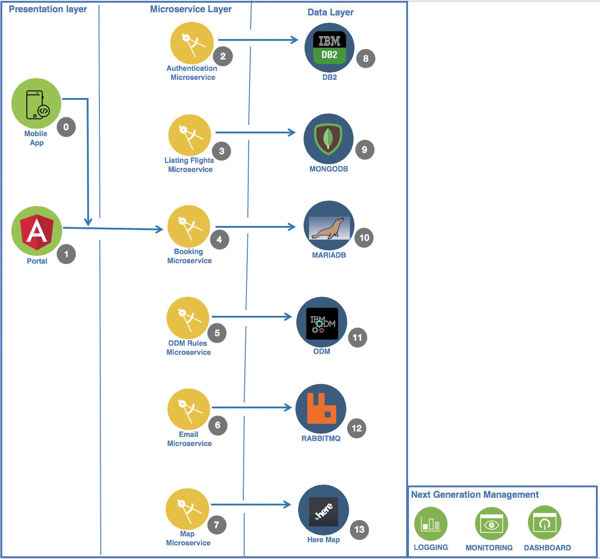

#  ICP-Airways
<h1 align="center">
  <br>
  <a href="https://github.com/SaifRehman/ICP-Airways"></a>
  <br>
      Air-Line ticketing and booking application on IBM Cloud Private 
  <br>
  <br>
</h1>

<h4 align="center">Powered by IBM Cloud Private</h4>

<p align="center">
  <a>
    
  </a>
</p>
<br>

# Building an Airline Booking Application based on Microservices Architecture on IBM Cloud Private
### Introduction

In this Code Pattern, we will build a cloud native application based on microservice architecture, IBM Middlewares and following 12 factor practices. This application is an Airline Booking app, and the technologies behind this app are:- 
* Nodejs (Typescript)
* IBM DB2
* IBM ODM
* RabbitMQ,
* Celery
* Angular
* Hypereledger Fabric
* Hyperledger Burrow
* Solidity
* Docker
* Kubernetes 
* IBM Cloud Private

Cloud native application is a buzzword these days. Technologies like Kubernetes and Docker are picking up reputation and popularity in Cloud native world. This Pattern will show an end to end process of building highly available Cloud Native Application on IBM Cloud Private. The Application backend is based on Nodejs and DB2 as a Database. The frontend is built using Angular4. Distributed Asynchronous task que is based on RabbitMQ and Celery. Container orchestration is managed by Kubernetes. Finally, the Blockchain is based on Hyperledger Fabric, Hyperledger Burrow and Ethereum Smart Contract. 

### Learning objectives
When you've completed this Code Pattern, you will understand how to:

* Break the application into different microservices
* Deploying microservices based application on IBM Cloud Private
* Leveraging IBM Middlewares such as ODM and DB2 on Kubernetes
* Designing buisness rules and decision by IBM ODM
* Create distributed task ques using RabbitMQ and Celery
* Leveraging DB2 as backend data storage
* Deploying Ethereum smart contract on Hyperledger fabric by leveraging Hyperledger Burrow
* Learn how to use IBM Cloud Private, Docker, and Kubernetes

#### Flow

1. *USER*:- End user who will acces the application
2. *APPUI*:- The user interface is built using Angular4. It leverages restful endpoints by backend microservices
3. *Login Microservice*:- This Microservice allows the user to login to the application 
4. *Signup Microservice*:- This Microservice allows the user to signup to the application
5. *Checkin Microservice*:- This Microservice allows the user checkin to a given booked flight
6. *Listing Microservice*:- This Microservice allows the user to list and browse the available flights
7. *Booking Microservice*:- This Microservice allows the user to to book an available flight
8. *Blockchain Microservice*:- This Microservice helps to communicate with the Blockchain
9. *IBM DB2*:- SQL Database for storing data
10. *ODM Microservice*:- This Microservice helps to communicate with the ODM Service
11. *ODM*:- IBM Operational Decision Manager is an advanced business rules management system that helps you capture, automate and govern frequent, repeatable business decisions and adds real-time decision making to your day-to-day operations
12. *Email Microservice*:- Email Microservice communicates with RabbitMQ and Celery to send email in asynchronous ques
13. *RabbitMQ*:- RabbitMQ is a messaging broker - an intermediary for messaging. It gives your applications a common platform to send and receive messages, and your messages a safe place to live until received.
14. *Celery*:- Celery is an asynchronous task queue/job queue based on distributed message passing
15. *Ethereum Proxy*:- Allows to communicate with Ethereum Virtual Machine
16. *Hyperledger Burrow EVM Chaincode Plugin*:- Allows Ethereum Capabilities on top of Hyperledger Fabric by leveraging Hyperledger Burrow
17. *Hyperledger Fabric*:- Hyperledger Fabric is a blockchain framework implementation and one of the Hyperledger projects hosted by The Linux Foundation. Intended as a foundation for developing applications or solutions with a modular architecture, Hyperledger Fabric allows components, such as consensus and membership services, to be plug-and-play

 

 #### Featured technologies
1. [Angular4](https://angular.io/):- Angular is a platform that makes it easy to build applications with the web. Angular combines declarative templates, dependency injection, end to end tooling, and integrated best practices to solve development challenges
2. [Nodejs](https://nodejs.org/en/):- An open-source JavaScript run-time environment for executing server-side JavaScript code.
3. [Typescript](https://www.typescriptlang.org/):- TypeScript is an open-source programming language developed and maintained by Microsoft. It is a strict syntactical superset of JavaScript, and adds optional static typing to the language
4. [Docker](https://www.docker.com/):- Docker is an open platform for developers and sysadmins to build, ship, and run distributed applications, whether on laptops, data center VMs, or the cloud.
5. [Kubernetes](https://kubernetes.io/):- Kubernetes is an open-source system for automating deployment, scaling, and management of containerized applications
6. [IBM DB2](https://www.ibm.com/analytics/us/en/db2/):- DB2 is a database product from IBM. It is a Relational Database Management System (RDBMS)
7. [IBM ODM](https://www.ibm.com/ae-en/marketplace/operational-decision-manager):- IBM® Operational Decision Manager is a comprehensive decision automation platform that helps you capture, analyze, automate and govern rules-based business decisions
8. [RabbitMQ](https://www.rabbitmq.com/):- RabbitMQ is lightweight and easy to deploy on premises and in the cloud. It supports multiple messaging protocols. RabbitMQ can be deployed in distributed and federated configurations to meet high-scale, high-availability requirements
9. [Celery](http://www.celeryproject.org/):- Celery is an asynchronous task queue/job queue based on distributed message passing.	It is focused on real-time operation, but supports scheduling as well
10. [Hyperledger Fabric](https://www.hyperledger.org/projects/fabric):- Hyperledger Fabric is a blockchain framework implementation and one of the Hyperledger projects hosted by The Linux Foundation. Intended as a foundation for developing applications or solutions with a modular architecture, Hyperledger Fabric allows components, such as consensus and membership services, to be plug-and-play
11. [Hyperledger Burrow](https://www.hyperledger.org/projects/hyperledger-burrow):- Hyperledger Burrow is one of the Hyperledger projects hosted by The Linux Foundation. Hyperledger Burrow was originally contributed by Monax and co-sponsored by Intel. Hyperledger Burrow provides a modular blockchain client with a permissioned smart contract interpreter partially developed to the specification of the Ethereum Virtual Machine (EVM
12. [Solidity](http://solidity.readthedocs.io/en/v0.4.24/):- Solidity is a contract-oriented, high-level language for implementing smart contracts. It was influenced by C++, Python and JavaScript and is designed to target the Ethereum Virtual Machine (EVM)

## Watch the Demo
needs to be recorded

## Deploy to IBM Cloud Private

### Pre-req installation 
1. Install [Nodejs](https://nodejs.org/en/download/)
2. Install [Kubectl](https://kubernetes.io/docs/tasks/tools/install-kubectl/)
3. Intall [Docker](https://docs.docker.com/install/)
4. Install [Angular4Cli](https://cli.angular.io)
5. Install [DBVisualiser](https://www.dbvis.com/download/)
6. Install gulpcli 
``` s
$ npm i gulp-cli -g
```

### Microservices available 
* [x] Booking-microservice
* [x] Checkin-microservice
* [x] Listing-microservice
* [x] Login-microservice
* [x] Signup-microservice
* [x] Db2-microservice
* [x] ODM-microservice
* [x] Email-microservice
* [x] Blockchain-microservice
* [x] Angular frontend microservice
* [x] Ethereum Proxy microservice
* [x] Celery microservice

### Connect Docker (Private registery) with IBM Cloud Private
1. From your terminal type
```
$ sudo nano /etc/hosts
```


2. Type in your ICP ip and provide a dns name, quit and save the file
3. Go to Docker prefernces


4. Navigate to Daemon tab, click on + button and add an entry “icpdns:85000”, click Apply & Restart button to restart Docker service. 


5. In your terminal type
```
$ docker login icpdns:8500
```
### Install all dependencies, create images and upload it to Private registery of IBM Cloud Private
1. Booking Microservice
```s
$ cd booking-microservice
$ npm i
$ docker build -t booking-microservice --no-cache .
$ docker tag booking-microservice <icpdns>:8500/default/booking-microservice:latest
$ docker push <icpdns>:8500/default/booking-microservice:latest
```
2. Checkin Microservice
```s
$ cd checkin-microservice
$ npm i
$ docker build -t checkin-microservice --no-cache .
$ docker tag checkin-microservice <icpdns>:8500/default/checkin-microservice:latest
$ docker push <icpdns>:8500/default/checkin-microservice:latest
```
3. Listing Microservice
```s
$ cd listing-microservice
$ npm i
$ docker build -t listing-microservice --no-cache .
$ docker tag listing-microservice <icpdns>:8500/default/listing-microservice:latest
$ docker push <icpdns>:8500/default/listing-microservice:latest
```
4. Login Microservice
```s
$ cd login-microservice
$ npm i
$ docker build -t login-microservice --no-cache .
$ docker tag login-microservice <icpdns>:8500/default/login-microservice:latest
$ docker push <icpdns>:8500/default/login-microservice:latest
```
5. Signup Microservice
```s
$ cd signup-microservice
$ npm i
$ docker build -t signup-microservice --no-cache .
$ docker tag signup-microservice <icpdns>:8500/default/signup-microservice:latest
$ docker push <icpdns>:8500/default/signup-microservice:latest
```

6. Celery Microservice
```s
$ cd celery
$ docker build -t celery --no-cache .
$ docker tag celery <icpdns>:8500/default/celery:latest
$ docker push <icpdns>:8500/default/celery:latest
```

7. Email Microservice
```s
$ cd email-microservice
$ npm i
$ docker build -t email-microservice --no-cache .
$ docker tag email-microservice <icpdns>:8500/default/email-microservice:latest
$ docker push <icpdns>:8500/default/email-microservice:latest
```

8. Ethereum Microservice
```s
$ cd ethereum-microservice
$ npm i
$ docker build -t ethereum-microservice --no-cache .
$ docker tag ethereum-microservice <icpdns>:8500/default/ethereum-microservice:latest
$ docker push <icpdns>:8500/default/ethereum-microservice:latest
```

9. Odm Microservice
```s
$ cd odm-microservice
$ npm i
$ docker build -t odm-microservice --no-cache .
$ docker tag odm-microservice <icpdns>:8500/default/odm-microservice:latest
$ docker push <icpdns>:8500/default/odm-microservice:latest
```

10. Frontend
```s
$ cd icp-frontend
$ npm i
$ docker build -t frontend --no-cache .
$ docker tag frontend <icpdns>:8500/default/frontend:latest
$ docker push <icpdns>:8500/default/frontend:latest
```
<!--
### Start minikube
```s
$ minikube start
```

### Some minikube commands
1. Get minikube master ip
``` s
$ minikube get ip
```
2. Get minikube dashboard
```s
$ minikube dashboard
```

3. Get minikube nodes
```s
$ minikube get nodes
```
4. Minikube enable adons
```s
$ minikube addons enable ingress
```
5. Get all minikube addons enabled and disabled
```s
$ minikube addons enable ingress
```
> remeber to use same terminal session

### Running config maps and secrets
1. Running config maps to load env variable for our microservices
```s
$ cd configMaps-secrets/configMaps
$ kubectl create -f configMaps.yml
$ kubectl get configmap
```
2. Running secrets to load env variable for our microservices to load username and pass safely instead of hardcoding
```s
$ cd configMaps-secrets/secrets
$ kubectl create -f secrets.yml
$ kubectl get secrets
```
### Run jenkins in kubernetes 
1. Deploy 
```s
$ cd jenkins
$ kubectl create -f deployment.yml
```
2. get external svc port is it deployed to
```
$ kubectl get scv
```
2. access jenkins ```http://minikubeip:scvport```


 


### Deploying DB2
1. Navigate to db2-microservice folder
```s
$ cd db2-microservice
```
2. Deploy to minikube
```s
$ kubectl create -f service-deployment.yml
```
3. Get pods name of db2
```s
$ kubectl get pods
```
4. ssh to pods container of db2
```s
$ kubectl exec -it podname bash
```
5. switch user to db2inst1
```s
$ su - db2inst1
```
6. Create Database and connect to it
```s
$ db2 create database SAMPLE
$ db2 connect to SAMPLE
```
7. Download existing flight data from github and set permissions
```s
$ wget https://raw.githubusercontent.com/SaifRehman/ICP-Airways/master/dataset/flights.csv
$ chown db2inst1:db2inst1 /home/db2inst1/flights.csv
```
8. Create Database and importing existing data to Flights table
* Flights Table
```SQL
db2 CREATE TABLE "SAMPLE.FlightsData (ID int NOT NULL , Year varchar(255) NULL , Month varchar(255) NULL, DayofMonth varchar(255) NULL, DepTime varchar(255) NULL,  CRSDepTime varchar(255) NULL, ArrTime varchar(255) NULL, CRSArrTime varchar(255) NULL, FlightNum varchar(255) NULL, TailNum varchar(255) NULL, ActualElapsedTime varchar(255) NULL, CRSElapsedTime varchar(255) NULL, Airtime varchar(255) NULL, ArrDelay varchar(255) NULL, DepDelay varchar(255) NULL,   Origin varchar(255) NULL, Dest varchar(255) NULL, Distance varchar(255) NULL, PRIMARY KEY (ID))"
``` 
* User Table
```SQL
db2 CREATE TABLE "SAMPLE.UserData (UserID int NOT NULL GENERATED ALWAYS AS IDENTITY (START WITH 1 INCREMENT BY 1) , LastName varchar(255) NULL , FirstName varchar(255) NULL, Location varchar(255) NULL, Email varchar(255) NULL,  Password varchar(255) NULL, Age int NULL, Tier varchar(255) NULL, PRIMARY KEY (UserID))"
```
* Booking Table
```SQL
db2 CREATE TABLE "SAMPLE.Booking (BookingID int NOT NULL GENERATED ALWAYS AS IDENTITY (START WITH 1 INCREMENT BY 1) ,TS TIMESTAMP NOT NULL , Checkin varchar(2555) NOT NULL, OfferNamePricing varchar(2555) NOT NULL, OfferTypePricing varchar(2555) NOT NULL , CostPricing varchar(2555) NOT NULL, OfferNameUpgrade varchar(2555) NOT NULL, OfferTypeUpgrade varchar(2555) NOT NULL , CostNameUpgrade varchar(2555) NOT NULL,  UserID INT NOT NULL, FlightID INT NOT NULL, FOREIGN KEY (UserID) REFERENCES SAMPLE.UserData(UserID), FOREIGN KEY (FlightID) REFERENCES SAMPLE.FlightsData(ID), PRIMARY KEY (BookingID))"
```
* Importing existing data to flights table
```s
$ db2  IMPORT FROM "/home/db2inst1/flights.csv" OF DEL INSERT INTO SAMPLE.FlightsData
```
### Deploying all backend microservices 
1. booking-microservice
```s
$ cd booking-microservice 
$ kubectl create -f service-deployment.yml
```
2. checkin-microservice
```s
$ cd checkin-microservice 
$ kubectl create -f service-deployment.yml
```
3. listing-microservice
```s
$ cd listing-microservice 
$ kubectl create -f service-deployment.yml
```
4. login-microservice
```s
$ cd login-microservice 
$ kubectl create -f service-deployment.yml
```
5. signup-microservice
```s
$ cd signup-microservice 
$ kubectl create -f service-deployment.yml
```
### Running Angular Microservice Frontend
1. Navigate to ```icp-frontend```
```s
$ cd icp-frontend
```
2. Build Docker image
```s
$ docker build -t angular .
```
3. Deploy
```s
$ kubectl create -f service-deployment.yml
```
### High level Architecture Diagram
 -->